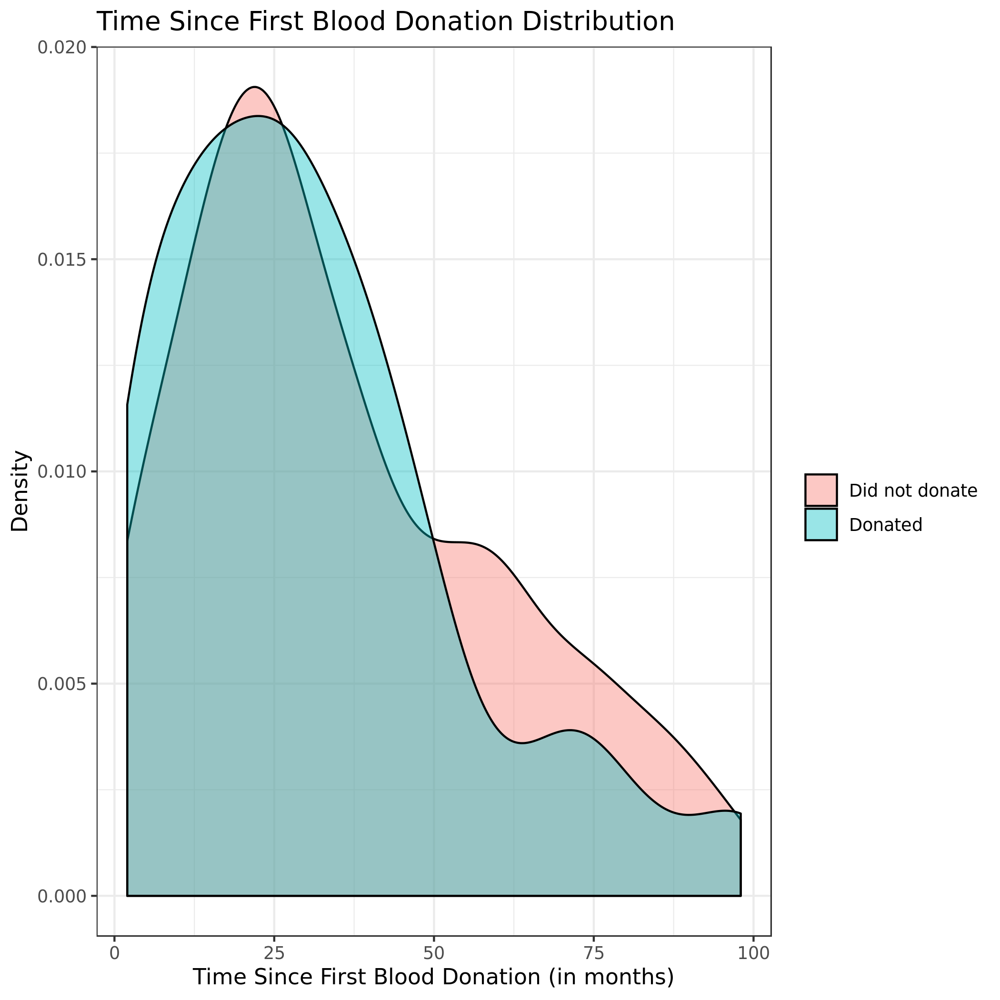
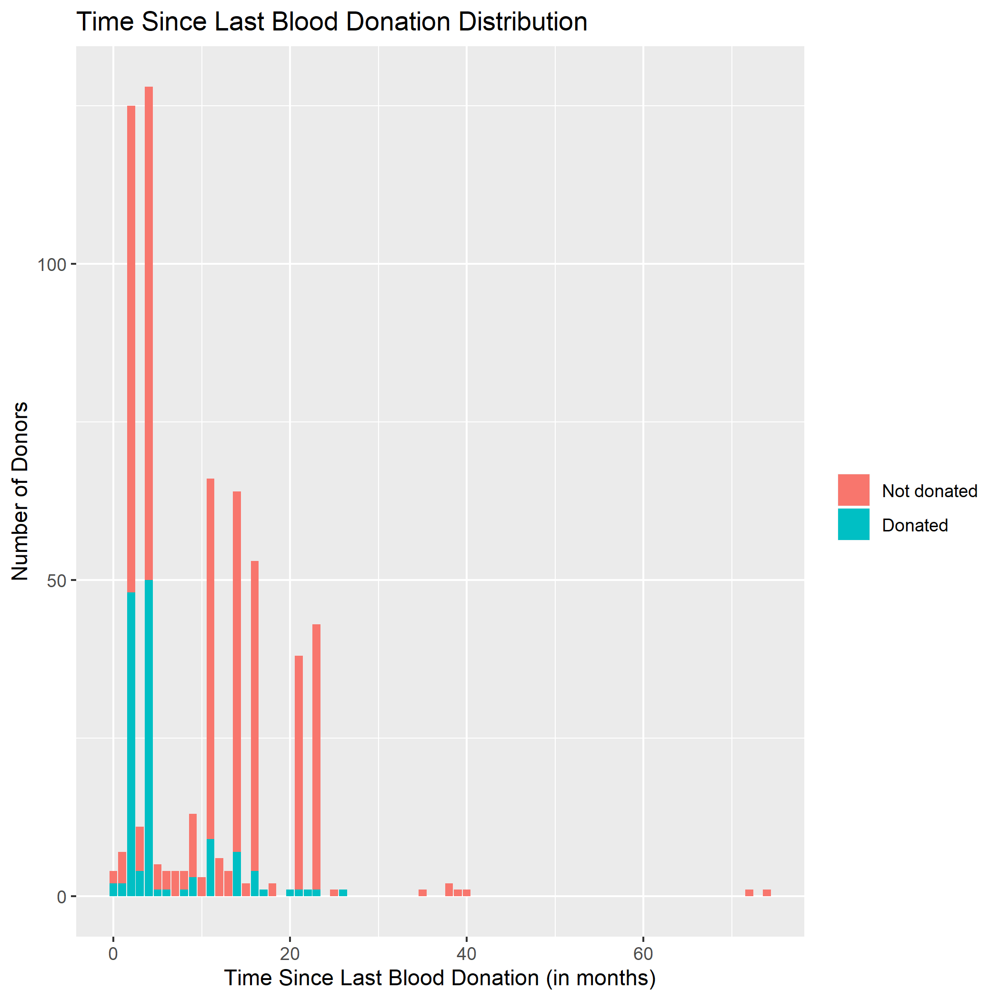
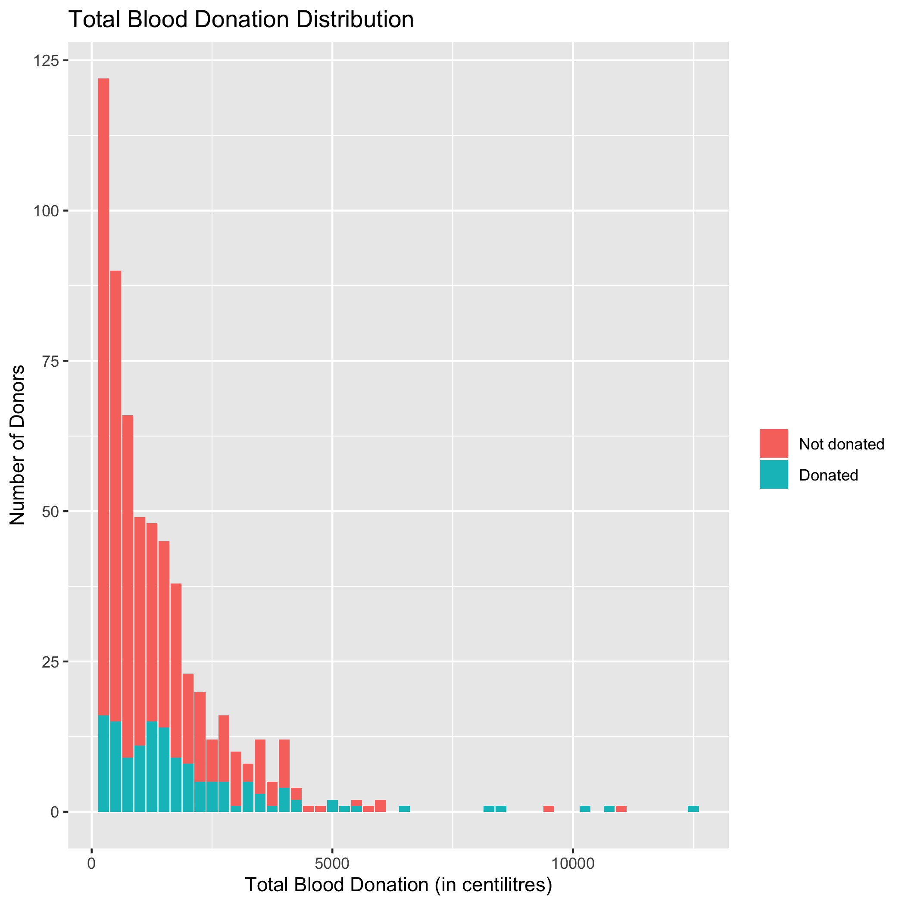

Blood Donation Predictors Report
================
Group 305
24/01/2020

``` r
library(rmarkdown)
library(markdown)
library(knitr)
library(reticulate)
os <- import("os")
```

## Introduction

Blood donations are a vital component of saving lives, and there is an
ever-growing need for healthy and clean volunteer donors (Gillespie &
Hillyer, 2002). Finding donors that will be a repeated donor is a hard
task for many transfusion centers (Armitage & Conner, 2001). This leads
to a need for understanding what motivates individuals to donate blood,
and whether there are certain factors that effect if someone chooses to
donate blood or not, specifically if they have previously been a donor.
To try and address this question we explore a dataset provided by
I-Cheng et al. (2008), which indicates whether an individual donated
blood or not. Each donor has four characteristics associated with them,
(1) the time in months since their last donation (Recency), (2) the
total number of times they have donated (Frequency), (3) the total
amount of blood they have donated in centilitres (Monetary), and (4) the
time since their first donation in months (Time). We are using this
dataset to observe whether these features influence whether an
individual donated blood.

## Preliminary EDA

Before creating any models or statistical tests we conducted a
preliminary exploratory data analysis to provide insights into how or
model would perform. Prior to the EDA we split our data into train and
test sets, and the used the train set to derive information. As shown in
Table 1, we determined that there were 598 observation in our train
dataset. We separated our data into two additional tables based on the
target class, Table 2 for only those that did not donate, and Table 3
which was only cases where there was a donation. Based on this
separation we saw our data was imbalanced. Class 1 representing those
candidates who did not donate, had 460 observations, versus class 2 with
138 individuals who did donate. We also noted from Table 1 that almost
all features had a high variance, which indicated to us that these may
not be exceptionally predictive.

``` python
import pandas as pd
blood_df_train = pd.read_csv('../data/processed/train_data.csv').drop('Unnamed: 0', axis = 1)
print('Table 1:')
```

    ## Table 1:

``` python
blood_df_train.describe()
```

    ##        since_last_don  total_dons   total_blood  since_first_don       Class
    ## count      598.000000  598.000000    598.000000       598.000000  598.000000
    ## mean         9.951505    5.653846   1413.461538        35.030100    1.230769
    ## std          8.399130    5.939018   1484.754538        24.345691    0.421678
    ## min          0.000000    1.000000    250.000000         2.000000    1.000000
    ## 25%          4.000000    2.000000    500.000000        16.000000    1.000000
    ## 50%          9.000000    4.000000   1000.000000        28.000000    1.000000
    ## 75%         14.750000    7.000000   1750.000000        50.750000    1.000000
    ## max         74.000000   50.000000  12500.000000        98.000000    2.000000

``` python
print('Table 2:')
```

    ## Table 2:

``` python
blood_df_train[blood_df_train['Class']==1].describe()
```

    ##        since_last_don  total_dons   total_blood  since_first_don  Class
    ## count      460.000000  460.000000    460.000000       460.000000  460.0
    ## mean        11.315217    4.969565   1242.391304        36.121739    1.0
    ## std          8.699697    4.908215   1227.053762        24.566267    0.0
    ## min          0.000000    1.000000    250.000000         2.000000    1.0
    ## 25%          4.000000    2.000000    500.000000        16.000000    1.0
    ## 50%         11.000000    3.000000    750.000000        28.000000    1.0
    ## 75%         16.000000    7.000000   1750.000000        52.000000    1.0
    ## max         74.000000   44.000000  11000.000000        98.000000    1.0

``` python
print('Table 3:')
```

    ## Table 3:

``` python
blood_df_train[blood_df_train['Class']==2].describe()
```

    ##        since_last_don  total_dons   total_blood  since_first_don  Class
    ## count      138.000000  138.000000    138.000000       138.000000  138.0
    ## mean         5.405797    7.934783   1983.695652        31.391304    2.0
    ## std          5.175233    8.134998   2033.749576        23.314240    0.0
    ## min          0.000000    1.000000    250.000000         2.000000    2.0
    ## 25%          2.000000    3.000000    750.000000        15.000000    2.0
    ## 50%          4.000000    6.000000   1500.000000        28.000000    2.0
    ## 75%          4.000000   10.000000   2500.000000        41.750000    2.0
    ## max         26.000000   50.000000  12500.000000        98.000000    2.0

In addition to the tables we also created visualizations to help us
understand the distribution of the data. Though not included in this
report, in the EDA.ipynb file we looked at all observations together,
regardless of whether the observation indicated donated or not donated.
Through our plots we observed that almost all features had an
exponential distribution. This carried through to figures 1, 2, and 3
seen below where we chose to separate features based on class. The only
feature we did not create a figure for was total donations. This is
because total blood donations and total amount of blood donated had
almost identical results graphically. For all features plotted, both
classes had an exponential distribution and followed the same trend.
This indicated that these features may not be particularity strong in
binary classification, even though the data represented a binary
classification problem.

### Figure 1.



### Figure 2.



### Figure 3.



## Methods

To address our research question of whether our features could be used
as predictors for blood donation we decided to create and test three
models that are all designed to perform well in binary classification
problems. The three models were a Random Forest classifier, a Decision
Tree and a Logistic Regression Classifier. Prior to implementing the
models, we cleaned and processed the data to ensure there were no
missing or erroneous values. We then selected a random subset of the
class 1 portion of the training data to address the training imbalance,
so our model was trained on a dataset that had a 50% split of classes.
Once this was completed, we created mutliple models and performed a
GridCV search to tune for the best hyperparameters of each model with
10-fold cross validation to fit and train the model.

## Results

``` python
print('Table 4:')
```

    ## Table 4:

``` python
results = pd.read_csv('../results/analysis_result.csv')
rndm_frst = results.loc[4,'Random Forest']
lgst_rgrsn = results.loc[15,'Random Forest']
results
```

    ##                     method          Random Forest
    ## 0           Best_max_depth                    [4]
    ## 1   Best_min_samples_split                    [3]
    ## 2            Best_CV_Score   [0.7045454545454546]
    ## 3           Training_Error   [0.1863636363636364]
    ## 4         Validation_Error   [0.2857142857142857]
    ## 5                   method          Decision Tree
    ## 6           Best_max_depth                    [7]
    ## 7    Bestmin_samples_split                    [4]
    ## 8            Best_CV_Score   [0.6590909090909091]
    ## 9           Training_Error  [0.15000000000000002]
    ## 10        Validation_Error                [0.375]
    ## 11                  method    Logistic regression
    ## 12                       C                    [1]
    ## 13           Best_CV_Score   [0.7090909090909091]
    ## 14          Training_Error   [0.2727272727272727]
    ## 15        Validation_Error   [0.3214285714285714]

In table 4 we show the results for all three models, including the best
hyperparameters and the train and valdation errors. The depending on
random influence, either the Random Forest model at
\[0.2857142857142857\] or the Logistic Regression model at
\[0.3214285714285714\] had the best validation error. However, the
Logistic Regression model was significantly less overfit than the Random
Forest model since the difference between train and validation error was
much smaller than the difference in the Random Forest model.

## Discussion

Based on our results we infer that the features of 1) time since last
donation, 2) total number of donations, 3) total blood donated, and 4)
the time since the first donation, all combined have some predictive
power for whether a patient will donate blood. However, even with
training three models, the best train and test accuracy scores were low,
with an accuracy score of 0.5 being equivalent to random, the best score
of the best model isn’t much better than random in terms of strength of
predictive power. If a model was to be used to predict blood donation
based on these features we would recommend a logistic regression
classifier since the difference between train and validation error is
much less than the Random Forest model, and therefore it would be a
better model for generalization. However, since the predictive power for
these features is so low, regarless of the model, we wouldn’t recommend
using these features for predicting blood donation. We would suggest
that more reasearch need to be conducted to identify other features may
provide better predictions as to whether blood is donated by a past
donor.

## Conclusion

Based on our results we infer that the features of 1) time since last
donation, 2) total number of donations, 3) total blood donated, and 4)
the time since the first donation, all combined have some predictive
power for whether a patient will donate blood. However, since our
accuracy and cross validation scores were low, the combined predictive
power of these features is quite low. Since the predictive power is so
low, we suggest that these features don’t have a strong influence on
whether a patient donates blood or not. We would suggest that other
factors may provide better predictions as to whether blood is donated by
a past donor.

## References

Armitage, C. J., & Conner, M. (2001). Social cognitive determinants of
blood donation. Journal of applied social psychology, 31(7), 1431-1457.
</br></br> de Jonge, Edwin. 2018. Docopt: Command-Line Interface
Specification Language. <https://CRAN.R-project.org/package=docopt>.
</br></br> Gillespie, T. W., & Hillyer, C. D. (2002). Blood donors and
factors impacting the blood donation decision. Transfusion Medicine
Reviews, 16(2), 115-130. </br></br> Keleshev, Vladimir. 2014. Docopt:
Command-Line Interface Description Language.
<https://github.com/docopt/docopt>. </br></br> R Core Team. 2019. R: A
Language and Environment for Statistical Computing. Vienna, Austria: R
Foundation for Statistical Computing. <https://www.R-project.org/>.
</br></br> Pedregosa, F., Varoquaux, G., Gramfort, A., Michel, V.,
Thirion, B., Grisel, O., … & Vanderplas, J. (2011). Scikit-learn:
Machine learning in Python. Journal of machine learning research,
12(Oct), 2825-2830 </br></br> VanderPlas et al. Altair: Interactive
Statistical Visualizations for Python. Journal of Open Source Software
(2018) </br></br> Van Rossum, Guido, and Fred L. Drake. 2009. Python 3
Reference Manual. Scotts Valley, CA: CreateSpace. </br></br> Wes
McKinney. Data Structures for Statistical Computing in Python,
Proceedings of the 9th Python in Science Conference, 51-56 (2010)
(publisher link) </br></br> Wickham, H. (2016). ggplot2: elegant
graphics for data analysis. Springer. </br></br> Wickham, Hadley. 2017.
Tidyverse: Easily Install and Load the ’Tidyverse’.
<https://CRAN.R-project.org/package=tidyverse>. </br></br> Xie, Yihui.
2014. “Knitr: A Comprehensive Tool for Reproducible Research in R.” In
Implementing Reproducible Computational Research, edited by Victoria
Stodden, Friedrich Leisch, and Roger D. Peng. Chapman; Hall/CRC.
<http://www.crcpress.com/product/isbn/9781466561595>. </br></br> Yeh, I.
C., Yang, K. J., & Ting, T. M. (2009). Knowledge discovery on RFM model
using Bernoulli sequence. Expert Systems with Applications, 36(3),
5866-5871 </br></br>
