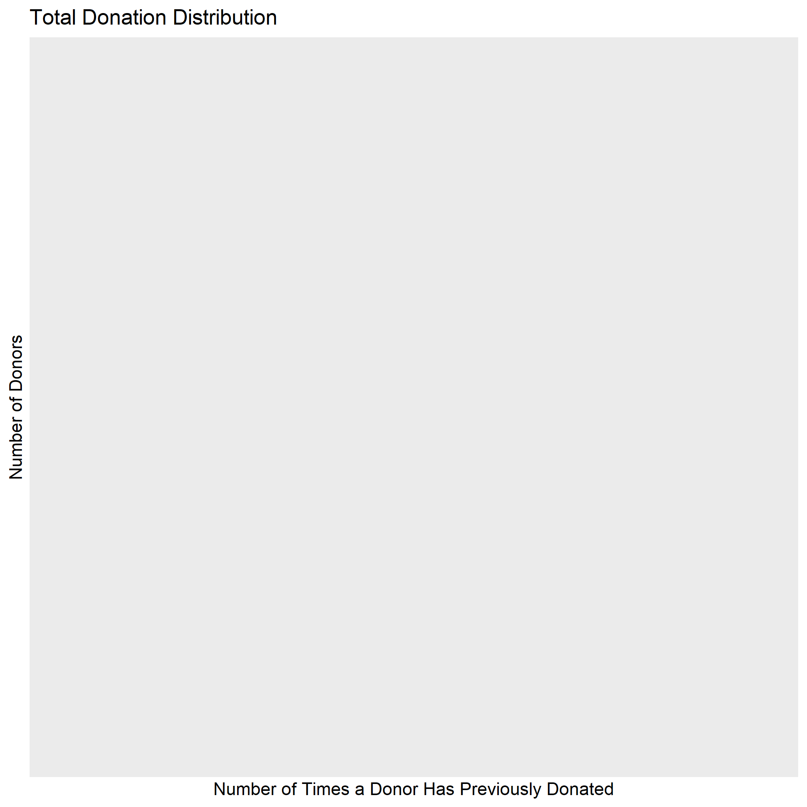

## Introduction

Blood donations are a vital component of saving lives, and there is an ever-growing need for healthy and clean volunteer donors (Gillespie & Hillyer, 2002). Finding donors that will be a repeated donor is a hard task for many transfusion centers (Armitage & Conner, 2001). This leads to a need for understanding what motivates individuals to donate blood, and whether there are certain factors that effect if someone chooses to donate blood or not, specifically if they have previously been a donor. To try and address this question we explore a dataset provided by I-Cheng et al. (2008) which indicates whether an individual donated blood or not. Each donor has four characteristics associated with them, (1) the time in months since their last donation (Recency), (2) the total number of times they have donated (Frequency), (3) the total amount of blood they have donated in centilitres (Monetary), and (4) the time since their first donation in months (Time). We are using this dataset to observe whether these features influence whether an individual donated blood.

## Preliminary EDA 

Before creating any models or statistical tests we conducted a preliminary exploratory data analysis to provide insights into how or model would perform. Prior to the EDA we split our data into train and test sets, and the used the train set to derive information. As shown in Table 1, we determined that there were 598 observation in our train dataset. We separated our data into two additional tables based on the target class, Table 2 for only those that did not donate, and Table 3 which was only cases where there was a donation. Based on this separating we saw our data was imbalanced. Class 1 representing those candidates who did not donate, had 460 observations, versus class 2 with 138 individuals who did donate. We also noted from Table 1 that almost all features had a high variance, which indicated to us that these may not exceptionally predictive. 

```{python}
import pandas as pd
blood_df_train = pd.read_csv('../data/processed/train_data.csv').drop('Unnamed: 0', axis = 1)
print('Table 1:')
blood_df_train.describe()
```


```{python}
print('Table 2:')
blood_df_train[blood_df_train['Class']==1].describe()
```

```{python}
print('Table 3:')
blood_df_train[blood_df_train['Class']==2].describe()
```

In addition to the tables we also created visualization to help us understand the distribution of the data. Though not included in this report, in the EDA.ipynb file we looked at all observations together, regardless of whether the observation indicated donated or not donated, through our plots observed that almost all features had an exponential distribution. This carried through to figures 1, 2, 3 and 4 seen below where we chose to separate the features based on class. Both classes had an exponential distribution and followed the same trend. This indicated that these features may not be particularity strong in binary classification, even though the data represented a binary classification problem. 

### Figure 1.


### Figure 2.


### Figure 3.


### Figure 4.



## Methods

We implemented a decision tree model from Scikit Learn to follow through on our observations from the EDA and address our research question. We chose a decision tree since it is suited to binary classification and is easily interpretable. Prior to implementing the model, we cleaned and processed the data to ensure there were no missing or erroneous values. We then selected a random subset of the class 1 portion of the training data to address the training imbalance, so our model was trained on a dataset that had a 50% split of classes. Once this was completed, we created a decision tree model and performed a GridCV search to tune for the best maximum depth hyperparameter with 10-fold cross validation to fit and train the model.

## Results 

As shown in Table 4., with our GridCV search we were able to determine that the best `max_depth` setting was 7. With that value we got a CV accuracy score of 0.65, with a training error of 0.14 and a validation error of 0.35. 


```{python}
print('Table 4:')
pd.read_csv('../results/analysis_result.csv').drop('Unnamed: 0', axis = 1)
```


## Discussion

Based on our results we infer that the features of 1) time since last donation, 2) total number of donations, 3) total blood donated, and 4) the time since the first donation, all combined have some predictive power for whether a patient will donate blood. However, since our accuracy and cross validation scores were low, the combined predictive power of these features is quite low. Since the predictive power is so low, we wouldn’t recommend this model as a predictive tool for predicting blood donation. We would suggest that other factors may provide better predictions as to whether blood is donated by a past donor. 

## Conclusion

Based on our results we infer that the features of 1) time since last donation, 2) total number of donations, 3) total blood donated, and 4) the time since the first donation, all combined have some predictive power for whether a patient will donate blood. However, since our accuracy and cross validation scores were low, the combined predictive power of these features is quite low. Since the predictive power is so low, we wouldn’t recommend this model as a predictive tool for predicting blood donation. We would suggest that other factors may provide better predictions as to whether blood is donated by a past donor. 

## References

Armitage, C. J., & Conner, M. (2001). Social cognitive determinants of blood donation. Journal of applied social psychology, 31(7), 1431-1457.
</br></br>
de Jonge, Edwin. 2018. Docopt: Command-Line Interface Specification Language. https://CRAN.R-project.org/package=docopt.
</br></br>
Gillespie, T. W., & Hillyer, C. D. (2002). Blood donors and factors impacting the blood donation decision. Transfusion Medicine Reviews, 16(2), 115-130.
</br></br>
Keleshev, Vladimir. 2014. Docopt: Command-Line Interface Description Language. https://github.com/docopt/docopt.
</br></br>
R Core Team. 2019. R: A Language and Environment for Statistical Computing. Vienna, Austria: R Foundation for Statistical Computing. https://www.R-project.org/.
</br></br>
Van Rossum, Guido, and Fred L. Drake. 2009. Python 3 Reference Manual. Scotts Valley, CA: CreateSpace.
</br></br>
Wickham, Hadley. 2017. Tidyverse: Easily Install and Load the ’Tidyverse’. https://CRAN.R-project.org/package=tidyverse.
</br></br>
Xie, Yihui. 2014. “Knitr: A Comprehensive Tool for Reproducible Research in R.” In Implementing Reproducible Computational Research, edited by Victoria Stodden, Friedrich Leisch, and Roger D. Peng. Chapman; Hall/CRC. http://www.crcpress.com/product/isbn/9781466561595.
</br></br>
Yeh, I. C., Yang, K. J., & Ting, T. M. (2009). Knowledge discovery on RFM model using Bernoulli sequence. Expert Systems with Applications, 36(3), 5866-5871
</br></br>

